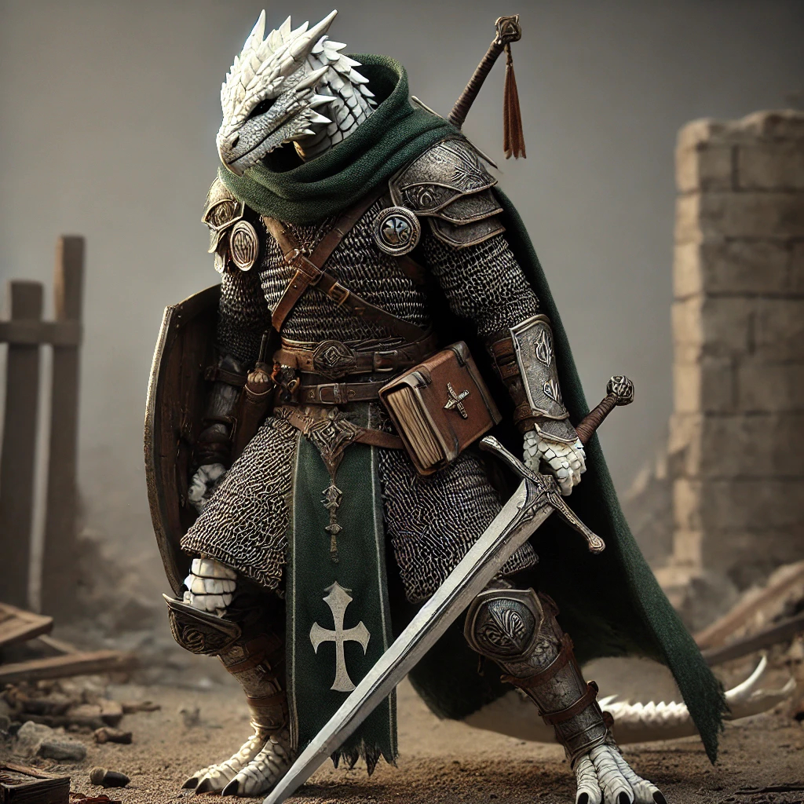

# Torrent "Pomstichtivec"

> Paladin, Oath of Vengeance

## Specie: Dragonborn

The ancestors of dragonborn hatched from the eggs of chromatic and metallic dragons. One story holds that these eggs were blessed by the dragon gods Bahamut and Tiamat, who wanted to populate the multiverse with people created in their image. Another story claims that dragons created the first dragonborn without the gods’ blessings. Whatever their origin, dragonborn have made homes for themselves on the Material Plane.

Dragonborn look like wingless, bipedal dragons — scaly, bright-eyed, and thick-boned with horns on their heads — and their coloration and other features are reminiscent of their draconic ancestors.

### Dragonborn Traits

- **Creature Type:** Humanoid
- **Size:** Medium (about 5–7 feet tall)
- **Speed:** 30 feet
- **Draconic Ancestry:** White (Cold) 

## Subclass: Oath of Vengeance

> Punish Evildoers at Any Cost

The Oath of Vengeance is a solemn commitment to punish those who have committed grievously evil acts. When evil armies slaughter helpless villagers, when a tyrant defies the will of the gods, when a thieves’ guild grows too violent, when a dragon rampages through the countryside—at times like these, paladins arise and swear an Oath of Vengeance to set right what has gone wrong.

These paladins share the following tenets:

- Show the wicked no mercy.
- Fight injustice and its causes.
- Aid those harmed by injustice.

## Background: Sage

You spent your formative years traveling between manors and monasteries, performing various odd jobs and services in exchange for access to their libraries. You whiled away many a long evening studying books and scrolls, learning the lore of the multiverse—even the rudiments of magic—and your mind yearns for more.

- **Skill Proficiencies:** Arcana, History
- **Tool Proficiencies:** Calligrapher's Supplies

## Character Details

- **Alignment:** Lawful Neutral

Lawful Neutral individuals act in accordance with law, tradition, or personal codes. Someone who follows a disciplined rule of life—and isn't swayed either by the demands of those in need or by the temptations of evil—is probably Lawful Neutral.

- **Faith:** Helm, god of protection

Helm, also known as the Vigilant One and The Watcher, was the god of guardians, protection, and protectors. He was worshiped by guards and paladins both, long being seen as a cold and focused deity who impartially took the role of defender and sometimes also enforcer.

- **Lifestyle:** Comfortable (2GP)

Choosing a comfortable lifestyle means that you can afford nicer clothing and can easily maintain your equipment. You live in a small cottage in a middle-class neighborhood or in a private room at a fine inn. You associate with merchants, skilled tradespeople, and military officers.

## Physical Characteristics

|        |   |
| ------ | - |
| Hair   | bez vlasů |
| Skin   | bílé šupiny s ledově modrým nádechem |
| Eyes   | oranžová duhovka, vertikální zornička |
| Height | 6,9 feeet (210 cm) |
| Weight | 485 lbs (220 kg) |
| Age    | 28 |
| Gender | Male |

## Backstory

Torrent Pomstichtivec se narodil neobvyklým způsobem – jako vejce nalezené dvěma lidskými městskými strážemi. Tento laskavý pár, který neměl vlastní děti, přijal vejce jako dar od osudu. Když se z vejce vyklubal dračí chlapec s lesklými bílými šupinami, pojmenovali ho Torrent a vychovali ho s láskou a péčí, jako by byl jejich vlastní.
Torrent vyrůstal ve stínu města, jehož obyvatelé se na jeho dračí podobu dívali s různou mírou obav a nedůvěry. Bílá barva jeho šupin, ač krásná, vyvolávala šeptandu o neštěstí či temnotě. Přesto se Torrent vždy mohl spolehnout na pevné vedení svých rodičů, kteří v něm pěstovali smysl pro spravedlnost a ochranu – hodnoty, které sami dodržovali jako městské stráže. I přes diskriminaci si Torrent dokázal najít několik věrných přátel, kteří se stali jeho oporou. Společně si hráli na dobrodruhy a hledali „poklady“, inspirovaní příběhy o legendárních hrdinech.
Všechno se však změnilo jednoho osudného dne, kdy město napadla skupina banditů pod vedením zrádného velitele. Torrent byl svědkem strašlivé ztráty – nejen jeho adoptivní rodiče, ale i přátelé padli při obraně města. Tato tragédie zlomila jeho mladou duši. Poháněn hněvem a bolestí se Torrent vydal na cestu krvavé pomsty, pronásledující všechny, kteří měli spojitost s útokem. Postupně se z něj stával chladnokrevný zabiják, poháněný slepou nenávistí, který nepoznával hranice. Cítil, že odplácí spravedlnost, ale s každou další smrtí ztrácel část sebe.
Na konci této temné cesty stanul před posledním viníkem – vůdcem banditů, který měl na svědomí útok. Když měl možnost zasadit smrtící úder, zastavil se. Pohled do očí svého nepřítele mu ukázal zrcadlo – s hrůzou si uvědomil, že se sám stal monstrem, které kdysi přísahal zničit.
Plný viny a zmatku se Torrent vydal hledat vykoupení. Na své pouti našel chrám zasvěcený Helmovi, bohu ochrany a spravedlnosti. Kněží ho nevítali s pochvalou, ale ukázali mu cestu zpět na stranu dobra. Torrent přijal Helmovu víru a složil Oath of Vengeance, ale tentokrát s hlubším porozuměním – zavázal se chránit nevinné a bojovat proti zlu spravedlivě, bez nenávisti a slepé zuřivosti.
Poté, co splnil svou přísahu a vykoupil se, Torrent nalezl nový smysl života. Rozhodl se stát Sagem, učencem, který hledá ztracené vědění a chrání pravdu před těmi, kdo by ji mohli zneužít. Jeho dřívější láska k příběhům o dobrodružství a pokladech se znovu probudila, ale tentokrát sloužila vyššímu cíli. Torrent Pomstichtivec, známý jako strážce moudrosti, se stal symbolem vykoupení, naděje a odvahy čelit nejen vnějším nepřátelům, ale i temnotě ve svém vlastním srdci.

## Notes

Na svých cestách mohl Torrent narazit na mnoho různorodých organizací, které by obohatily jeho příběh a přinesly zajímavé interakce. Zde je několik návrhů, které zahrnují různé typy skupin:

### **1. Náboženské řády**
- **Helmovi kněží:** Torrent už v minulosti našel útočiště v chrámu Helma, ale mohl by narazit na další kněze nebo poutníky sloužící tomuto bohu. Někteří mohli být ochotni ho vést, jiní by mohli zpochybňovat jeho minulost.
- **Řád Bahamuta:** Pokud by narazil na rytíře nebo kněží zasvěcené dračímu bohu Bahamutovi, možná by našli společnou řeč díky jejich lásce ke spravedlnosti.
- **Řád Tyrův:** Paladinové a kněží boha Tyra, boha spravedlnosti, by mohli být spojenci nebo dokonce mentoři Torrenta na jeho cestě.

### **2. Dobrodružné gildy a cechy**
- **Hledači pokladů:** Skupina dobrodruhů, která sdílí Torrentovu lásku k hledání pokladů, by mohla být buď jeho spojenci, nebo konkurenty na nebezpečné výpravě.
- **Cech průzkumníků:** Organizace zaměřená na mapování světa a odhalování tajemství starodávných ruin. Mohli by ocenit jeho znalosti nebo ho požádat o pomoc při riskantní výpravě.
- **Lovci artefaktů:** Skupina, která hledá magické předměty. Někteří by mohli být dobrodinci, jiní by mohli mít sobecké či zlověstné úmysly, což by mohlo Torrenta stavět před morální dilemata.

### **3. Temné organizace**
- **Zločinecké kartely:** Torrent by mohl čelit skupinám pašeráků, žoldáků nebo nájemných vrahů, které ztělesňují to, čím se kdysi sám málem stal.
- **Kult Tiamat:** Temný kult uctívající dračí bohyni Tiamat by mohl Torrenta vnímat jako hrozbu kvůli jeho spojení s Helmou nebo Bahamutem. Mohli by se pokusit ho obrátit na svou stranu, anebo ho zničit.

### **4. Učené společnosti**
- **Akademie vědomostí:** Řád učených mudrců a mágů, který by mohl sdílet Torrentovu touhu po moudrosti a ochraně vědomostí. Možná mu nabídnou přístup k tajným textům, nebo ho požádají o pomoc při hledání dávno ztracených knih.
- **Strážci historie:** Skupina archivářů, kteří chrání pravdivé dějiny před těmi, kdo by je chtěli přepisovat či zničit. Mohli by Torrenta oslovit jako ochránce artefaktů a příběhů.

### **5. Rytířské řády**
- **Rytíři Zlatého Lva:** Řád chránící nevinné a bojující za vyšší dobro. Torrent by zde mohl najít spřízněné duše, které sdílejí jeho cíle.
- **Temní strážci:** Pokud by Torrent hledal rovnováhu mezi světlem a tmou, mohl by narazit na řád, který chrání svět před chaosem, ale neštítí se využívat kontroverzní metody.

### **6. Nezávislí spojenci**
- **Poustevníci a mudrci:** Torrent mohl na své pouti potkat samotáře, kteří vlastní neuvěřitelné znalosti nebo moudrost.
- **Putující bardové:** Tito vypravěči by mohli být pro Torrenta cenní nejen jako spojenci, ale také jako ti, kdo zaznamenají jeho příběhy a šíří je dál.
